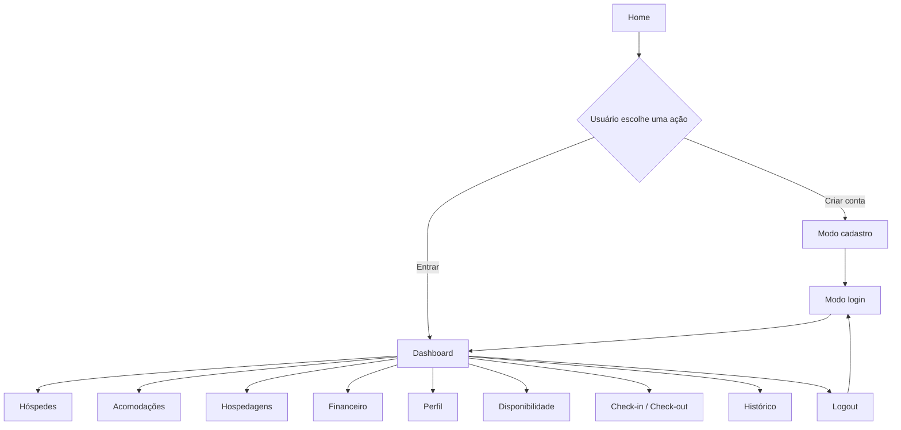

# Gestão Flats

Sistema web para administração de flats, hospedagens e operações financeiras. O projeto foi desenvolvido como uma aplicação front-end em React para centralizar rotinas de hospedagem em uma interface administrativa simples, responsiva e orientada a dados.

> Projeto acadêmico em evolução. Atualmente, a aplicação utiliza dados mockados e persistência local apenas para o estado de autenticação. A próxima grande etapa é a integração com um backend real.


## Sumário

- [Sobre o projeto](#sobre-o-projeto)
- [Objetivo](#objetivo)
- [Funcionalidades](#funcionalidades)
- [Tecnologias](#tecnologias)
- [Como executar](#como-executar)
- [Arquitetura](#arquitetura)
- [Componentes reutilizáveis](#componentes-reutilizáveis)
- [Fluxos principais](#fluxos-principais)
- [Dados atuais](#dados-atuais)
- [Limitações conhecidas](#limitações-conhecidas)
- [Próximos passos](#próximos-passos)
- [Contribuidores](#contribuidores)

## Sobre o projeto

O Gestão Flats é um painel administrativo para apoiar a operação de imóveis destinados a hospedagem. A aplicação reúne, em um único ambiente, informações sobre hóspedes, acomodações, reservas, disponibilidade, check-in/check-out, histórico e finanças.

O sistema foi pensado para reduzir a fragmentação das tarefas operacionais e oferecer uma visão rápida da rotina do negócio por meio de:

- dashboard com indicadores;
- cadastros e filtros;
- tabelas responsivas;
- controle visual de status;
- menu de conta e perfil administrativo;
- módulo financeiro com receitas, despesas e resumo.

## Objetivo

O objetivo do projeto é criar uma base de sistema de gestão para flats que seja:

- clara para uso diário por uma equipe administrativa;
- organizada em módulos independentes;
- responsiva para desktop e dispositivos menores;
- preparada para receber uma API e persistência real;
- fácil de evoluir com novos fluxos de hospedagem.

## Funcionalidades

### Acesso e conta

- Tela inicial com apresentação do produto.
- Alternância entre cadastro e login.
- Login demonstrativo com armazenamento do estado de autenticação no `localStorage`.
- Logout pelo menu do usuário.
- Após o logout, o sistema retorna diretamente ao formulário de login.
- Menu da conta com as opções `Ver perfil`, `Alterar conta` e `Sair`.
- Perfil administrativo com dados da conta, atividade recente, permissões e informações de segurança.
- Modal para edição de nome, e-mail e senha.

### Dashboard

O dashboard apresenta uma visão resumida da operação:

- hospedagens ativas;
- acomodações disponíveis;
- check-ins e check-outs do dia;
- resumo de receitas, despesas e saldo;
- percentual de ocupação;
- próximas movimentações.

### Hóspedes

- Listagem de hóspedes.
- Busca por nome ou documento.
- Filtro por status.
- Cadastro de novo hóspede.
- Edição de dados.
- Exclusão local de registros.
- Tabela adaptada para telas menores.

### Acomodações

- Listagem de flats, quartos, studios e apartamentos.
- Busca por nome da acomodação.
- Filtros por tipo e status.
- Cadastro e edição de acomodações.
- Exclusão local.
- Exibição de capacidade, valor da diária e situação atual.

### Hospedagens

- Listagem de reservas.
- Busca por hóspede ou acomodação.
- Filtro por status da hospedagem.
- Cancelamento visual de reserva.
- Exclusão local de reserva.
- Tela de nova hospedagem.
- Tela de detalhes de hospedagem.

### Disponibilidade

- Filtros por período, acomodação e status.
- Estrutura preparada para exibir a disponibilidade dos imóveis.

### Check-in e check-out

- Área destinada ao acompanhamento de entradas e saídas.
- Filtros operacionais.
- Estrutura de confirmação por modal.

### Histórico

- Registros de hospedagens concluídas e canceladas.
- Filtros por período e status.
- Modal com detalhes do registro selecionado.

### Financeiro

O acesso lateral apresenta apenas o item `Financeiro`. As subdivisões ficam dentro da própria página para evitar duplicidade na navegação:

- **Visão Geral:** indicadores de receitas, despesas e saldo.
- **Receitas:** busca, filtro, alteração de status e exclusão local.
- **Despesas:** busca, filtro, alteração de status e exclusão local.

## Tecnologias

- [React](https://react.dev/) `18.3.1`;
- [React DOM](https://react.dev/reference/react-dom) `18.3.1`;
- [Vite](https://vite.dev/) `5.4.10`;
- `@vitejs/plugin-react`;
- JavaScript com módulos ES;
- CSS próprio, sem biblioteca visual externa;
- `localStorage` para o estado demonstrativo de autenticação.

O projeto ainda não utiliza backend, banco de dados, biblioteca de rotas, testes automatizados ou ferramenta de lint configurada no `package.json`.

## Como executar

### Pré-requisitos

- Node.js instalado;
- npm instalado;
- Git, caso o projeto seja clonado.

### Instalação

```bash
git clone git@github.com:GabrielFelix-dev/GestaoFlats.git
cd GestaoFlats
npm install
```

### Ambiente de desenvolvimento

```bash
npm run dev
```

O Vite disponibiliza a aplicação em:

```text
http://localhost:5173/
```

Para permitir acesso por outros dispositivos da rede local:

```bash
npm run dev -- --host 0.0.0.0
```

### Build de produção

```bash
npm run build
```

### Pré-visualização do build

```bash
npm run preview
```

## Arquitetura

A aplicação utiliza uma composição de componentes React. O controle de tela é feito atualmente pelo estado `activeItem` em `src/App.jsx`; não há roteamento por URL implementado.

```text
src/
├── assets/
│   ├── fundo-pagina.png
│   ├── predios.png
│   └── gestãoflats-nome.png
├── components/
│   ├── AccountModal/
│   ├── Button/
│   ├── Card/
│   ├── Header/
│   ├── Input/
│   ├── Layout/
│   ├── Modal/
│   ├── Select/
│   ├── Sidebar/
│   └── Table/
├── data/
│   ├── despesas.js
│   ├── hospedagens.js
│   └── receitas.js
├── pages/
│   ├── Home/
│   └── Admin/
│       ├── Acomodacoes/
│       ├── CheckinCheckout/
│       ├── Dashboard/
│       ├── Disponibilidade/
│       ├── Financeiro/
│       ├── Historico/
│       ├── Hospedagens/
│       ├── Hospedes/
│       └── Perfil/
├── routes/
├── App.jsx
├── index.css
└── main.jsx
```

### Organização das responsabilidades

- `App.jsx`: estado de autenticação, estado da conta, navegação entre módulos e composição do roteamento interno.
- `Layout`: composição do cabeçalho, sidebar e área principal.
- `Header`: identidade da aplicação, título da página e menu da conta.
- `Sidebar`: navegação principal e controle de recolhimento.
- `pages`: telas e regras específicas de cada módulo.
- `components`: elementos visuais compartilhados.
- `data`: dados iniciais usados como mock no front-end.
- `assets`: imagens utilizadas na identidade visual e na tela inicial.

> `src/routes/AppRoutes.jsx` existe como ponto de extensão, mas está vazio. A navegação atual é controlada diretamente pelo `switch` de `src/App.jsx`.

## Componentes reutilizáveis

| Componente     | Responsabilidade                                                    |
| -------------- | ------------------------------------------------------------------- |
| `Button`       | Botões com variantes, tamanhos, estados e ações.                    |
| `Input`        | Campos com label, validação HTML, erro e texto auxiliar.            |
| `Select`       | Campos de seleção com opções e estados de erro.                     |
| `Card`         | Blocos de conteúdo com título, subtítulo e conteúdo customizável.   |
| `Table`        | Tabelas com colunas dinâmicas, dados, estado vazio e ações.         |
| `Modal`        | Overlay, fechamento por clique externo/Escape e rodapé customizado. |
| `AccountModal` | Edição dos dados da conta e validação de senha.                     |
| `Header`       | Cabeçalho, perfil resumido e ações da conta.                        |
| `Sidebar`      | Navegação lateral responsiva.                                       |
| `Layout`       | Estrutura compartilhada das páginas administrativas.                |

## Fluxos principais



### Autenticação atual

1. O `App` verifica a chave `gestao-flats:auth` no `localStorage`.
2. O envio do formulário de login dispara o evento `gestao-flats:login`.
3. O evento grava o valor `true` e abre o Dashboard.
4. O logout remove a chave e retorna à Home no modo login.

Esse fluxo é propositalmente demonstrativo. Ele não valida credenciais nem representa uma autenticação segura para produção.

## Dados atuais

O protótipo utiliza dados fixos ou mantidos em estado local:

- `src/data/hospedagens.js`: reservas mockadas;
- `src/data/receitas.js`: receitas mockadas;
- `src/data/despesas.js`: despesas mockadas;
- dados de hóspedes e acomodações: arrays definidos nas próprias páginas;
- dashboard, histórico, perfil e resumo financeiro: indicadores e registros demonstrativos.

As alterações feitas em cadastros, tabelas e conta não são persistidas em um banco e, em geral, são perdidas após atualizar a página.

## Limitações conhecidas

- Login sem validação real de credenciais.
- Cadastro sem criação de usuário persistido.
- Ausência de backend e banco de dados.
- Alterações de conta não sobrevivem ao refresh.
- Senha não é persistida.
- Disponibilidade e check-in/check-out ainda não possuem dados reais integrados.
- Algumas ações são demonstrativas e não executam uma operação de servidor.
- `Nova hospedagem` ainda utiliza comportamento local de demonstração.
- Indicadores do dashboard e do módulo financeiro são mockados e podem apresentar valores diferentes.
- Não há testes automatizados, lint ou pipeline de integração contínua configurados.
- A arquitetura documentada em `arquitetura.md` é uma referência inicial e pode divergir da árvore atual.

## Próximos passos

### Backend e persistência

- Criar uma API para usuários, hóspedes, acomodações, hospedagens e lançamentos financeiros.
- Modelar o banco de dados e seus relacionamentos.
- Persistir cadastros, alterações, exclusões e status.
- Integrar o front-end com endpoints reais.

### Autenticação e segurança

- Implementar cadastro real de usuários.
- Validar credenciais no servidor.
- Utilizar sessão segura ou tokens com expiração.
- Proteger rotas e operações administrativas por perfil de acesso.
- Implementar troca e recuperação de senha.

### Produto e operação

- Implementar disponibilidade baseada em reservas reais.
- Conectar check-in e check-out ao ciclo de uma hospedagem.
- Completar nova hospedagem e tela de detalhes.
- Unificar os indicadores do dashboard com o módulo financeiro.
- Adicionar paginação, ordenação e filtros no servidor.
- Permitir múltiplos usuários e níveis de permissão.

### Qualidade e manutenção

- Adicionar testes unitários e testes de fluxo com navegador.
- Configurar ESLint e formatação automática.
- Criar pipeline de integração contínua.
- Adicionar tratamento de erros, estados de carregamento e mensagens de sucesso.
- Implementar rotas reais, provavelmente com React Router.
- Atualizar a documentação de arquitetura conforme o sistema evoluir.

## Contribuidores

### Grupo Gestão Flats

Integrantes e contribuidores do Grupo Gestão Flats:

| Nome                     | Perfil                                                   |
| ------------------------ | -------------------------------------------------------- |
| Gabriel Felix            | [@GabrielFelix-dev](https://github.com/GabrielFelix-dev) |
| Samires do Carmo         | [@eusam04](https://github.com/eusam04)                   |
| Marina Guimarães         | [@marinagv95](https://github.com/marinagv95)             |
| José Luiz Nogueira Silva | [@jluizns](https://github.com/jluizns)                   |
| Ana Karolyne             | [@anakarolyne-oa](https://github.com/anakarolyne-oa)     |
| Raphael Vicente          | [@RaphaelVicente08](https://github.com/RaphaelVicente08) |


