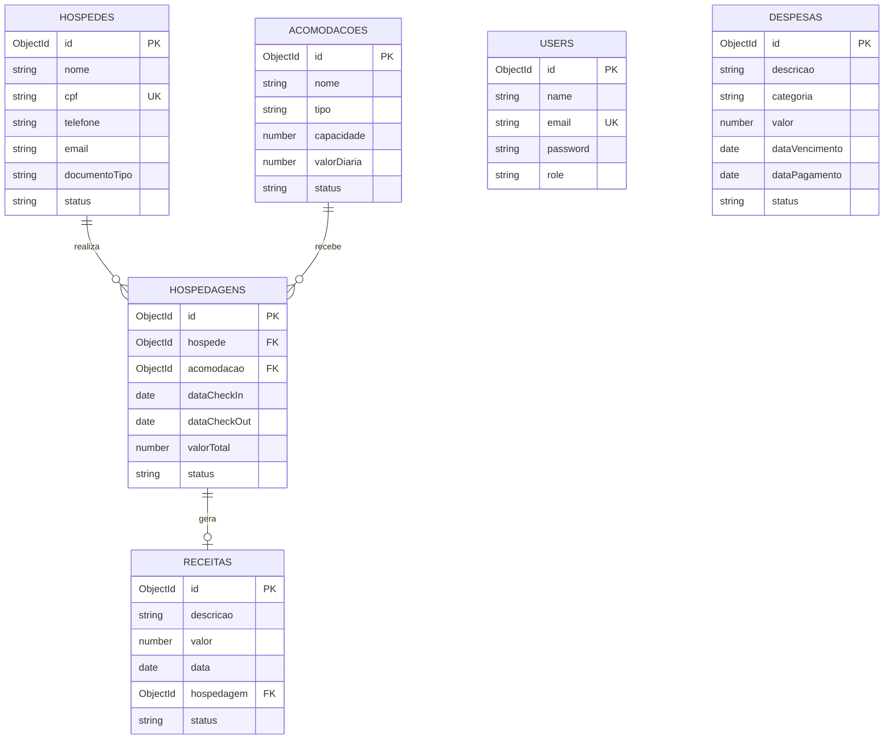
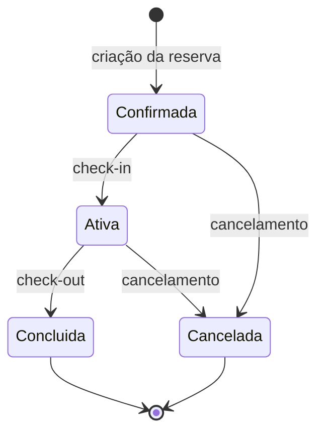
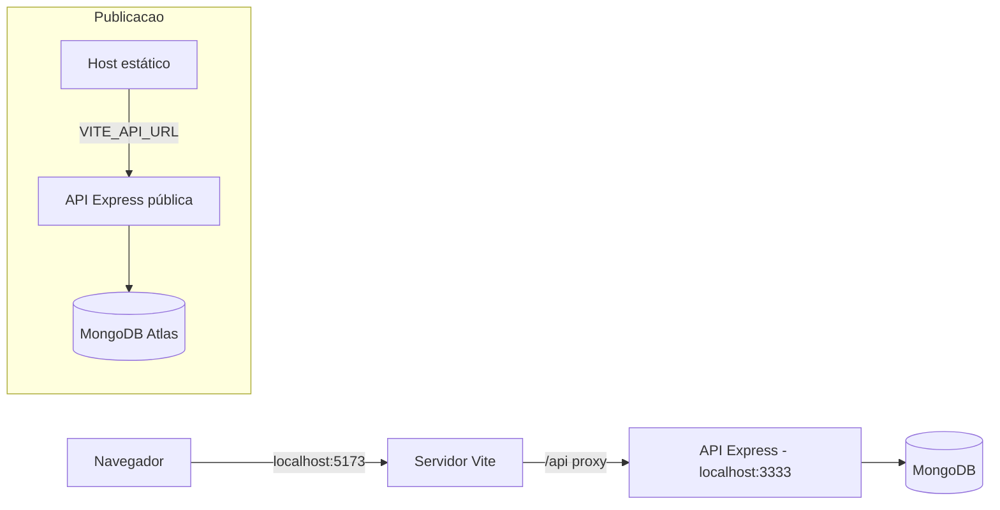
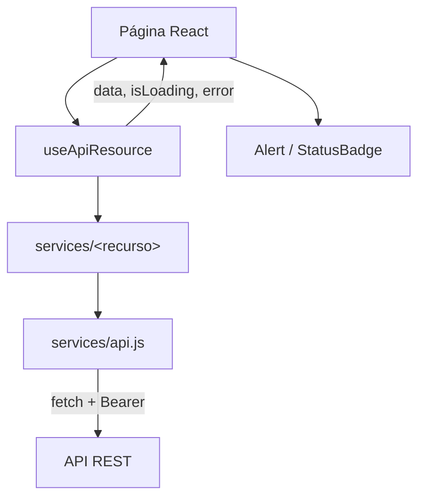

# Arquitetura do Gestão Flats

## Visão geral

O repositório é dividido em dois módulos independentes, cada um com seu próprio `package.json`:

```text
GestaoFlats/
│
├── frontend/                  # SPA em React com Vite
│   ├── src/
│   │   ├── assets/            # Imagens da identidade visual
│   │   ├── components/        # Componentes visuais reutilizáveis
│   │   ├── context/           # AuthContext: sessão e usuário autenticado
│   │   ├── hooks/             # useApiResource, useFeedback, useDebouncedValue
│   │   ├── pages/
│   │   │   ├── Home/          # Tela de apresentação e acesso
│   │   │   └── Admin/         # Módulos administrativos
│   │   │       ├── Acomodacoes/
│   │   │       ├── CheckinCheckout/
│   │   │       ├── Dashboard/
│   │   │       ├── Disponibilidade/
│   │   │       ├── Financeiro/
│   │   │       ├── Historico/
│   │   │       ├── Hospedagens/
│   │   │       ├── Hospedes/
│   │   │       └── Perfil/
│   │   ├── services/          # Cliente HTTP da API, um módulo por recurso
│   │   ├── utils/             # Formatação de moeda, datas e rótulos
│   │   ├── App.jsx            # Navegação entre módulos
│   │   ├── index.css
│   │   └── main.jsx
│   ├── public/                # Manifesto e service worker da PWA
│   ├── index.html
│   ├── package.json
│   └── vite.config.js         # Inclui proxy de /api para o back-end
│
├── backend/                   # API REST em Express
│   ├── src/
│   │   ├── config/
│   │   │   ├── database.js    # Conexão e eventos do Mongoose
│   │   │   └── env.js         # Leitura das variáveis de ambiente
│   │   ├── controllers/       # Um controller por módulo
│   │   ├── middlewares/       # auth, validate e error
│   │   ├── models/            # Schemas Mongoose
│   │   ├── routes/            # Um arquivo de rotas por módulo
│   │   ├── schemas/           # Validações Zod
│   │   ├── services/          # Regras de negócio
│   │   ├── utils/             # jwt, errors, enums, regex, asyncHandler
│   │   ├── app.js             # Composição do app Express
│   │   └── server.js          # Inicialização do servidor HTTP
│   ├── scripts/
│   │   └── smoke-test.js      # Teste de fumaça da API
│   ├── .env.example
│   └── package.json
│
└── package.json                # Comandos unificados
```

## Front-end

### Organização das responsabilidades

- `App.jsx`: página ativa, navegação entre módulos e composição do `Layout`.
- `context/AuthContext`: sessão do usuário — login, cadastro, logout, perfil e revalidação do token.
- `services`: cliente HTTP da API, com um módulo por recurso.
- `hooks`: carregamento de dados, mensagens de erro/sucesso e busca com atraso.
- `pages`: telas e regras específicas de cada módulo.
- `components`: elementos visuais compartilhados.
- `utils`: formatação de moeda, datas, diárias e rótulos dos enums.
- `assets`: imagens utilizadas na identidade visual e na tela inicial.

### Componentes reutilizáveis

| Componente     | Responsabilidade                                                       |
| -------------- | ---------------------------------------------------------------------- |
| `Button`       | Botões com variantes, tamanhos, estados e ações.                       |
| `Input`        | Campos com label, validação HTML, erro e texto auxiliar.               |
| `Select`       | Campos de seleção com opções e estados de erro.                        |
| `Card`         | Blocos de conteúdo com título, subtítulo, ação e conteúdo.             |
| `Table`        | Tabelas com colunas dinâmicas, dados, estados de carregamento e ações. |
| `Modal`        | Overlay, fechamento por clique externo/Escape e rodapé customizado.    |
| `Alert`        | Mensagens de sucesso e erro, com fechamento manual.                    |
| `StatusBadge`  | Etiqueta colorida conforme o status do registro.                       |
| `AccountModal` | Edição dos dados da conta e troca de senha.                            |
| `Header`       | Cabeçalho, perfil resumido e ações da conta.                           |
| `Sidebar`      | Navegação lateral responsiva.                                          |
| `Layout`       | Estrutura compartilhada das páginas administrativas.                   |

### Acesso aos dados

Nenhuma tela guarda dados próprios. O caminho é sempre o mesmo:

```text
página → useApiResource → services/<recurso> → services/api.js → API
```

- `services/api.js` concentra a URL base, o token, a serialização e o `ApiError`. Um `401` limpa a sessão e dispara `gestao-flats:unauthorized`.
- `useApiResource` devolve `data`, `isLoading`, `error` e `reload`; as telas chamam `reload()` depois de criar, editar ou excluir.
- `useDebouncedValue` evita uma requisição por tecla nos campos de pesquisa.
- `useFeedback` transforma exceções em mensagens exibidas em `<Alert>`.

### Fuso horário

Check-in, check-out, vencimento e lançamento são gravados como meia-noite UTC. Exibi-los no fuso local voltaria um dia em fusos negativos como o do Brasil, então `formatDate` formata em UTC. `formatDateTime`, usada em datas reais de criação, usa o fuso local.

### Estado atual

A navegação é controlada pelo estado `activeItem` em `src/App.jsx` e persistida no `localStorage`. A sessão é real: o cadastro apenas cria a conta e leva o usuário ao formulário de login, o token vem de `POST /api/auth/login` e é revalidado com `GET /api/auth/me` ao abrir a aplicação.

## Back-end

### Camadas

```text
routes → middlewares → controllers → services → models → MongoDB
```

| Camada        | Responsabilidade                                                   |
| ------------- | ------------------------------------------------------------------ |
| `routes`      | Caminhos, encadeamento de middlewares e controllers.               |
| `middlewares` | Autenticação JWT, validação com Zod e tratamento de erros.         |
| `controllers` | Conversão entre requisição/resposta HTTP e services.               |
| `services`    | Regras de negócio, consistência e cálculos.                        |
| `models`      | Schemas Mongoose, consultas ao MongoDB e mapeamento de documentos. |
| `schemas`     | Definição das regras de validação de payload (Zod).                |
| `utils`       | Tokens JWT, erros de aplicação, asyncHandler, regex e status.      |
| `config`      | Leitura de ambiente e conexão com o banco.                         |

### Coleções

Os nomes das coleções são declarados explicitamente em cada model, para não depender da regra de pluralização do Mongoose.

| Model        | Coleção       |
| ------------ | ------------- |
| `User`       | `users`       |
| `Hospede`    | `hospedes`    |
| `Acomodacao` | `acomodacoes` |
| `Hospedagem` | `hospedagens` |
| `Receita`    | `receitas`    |
| `Despesa`    | `despesas`    |

### Observações de implementação

- Todo model expõe consultas de listagem como `static` no schema (por exemplo `Hospede.listar(filtros)`), mantendo o acesso a dados dentro da camada de models.
- A senha nunca é retornada: o campo é `select: false` e o `toJSON` do `User` remove a propriedade.
- Todo controller é assíncrono e passa pelo `asyncHandler`, que encaminha rejeições ao middleware de erro — sem isso o Express 4 não captura promises rejeitadas.
- `schemas/common.schema.js` concentra os validadores compartilhados (data, e-mail, ObjectId e intervalo de datas).
- `routes/auth.routes.js` aplica um `express-rate-limit` de 20 tentativas por janela de 15 minutos sobre `register` e `login`. O contador vive em memória, então reiniciar a API o zera.
- `scripts/smoke-test.js` exercita a API por HTTP e remove ao final tudo o que criou. Como a limpeza depende da ordem (a hospedagem remove a receita vinculada, e só então a acomodação pode ser excluída), uma falha no meio do caminho deixa registros para trás.

### Entidades

Cada model do Mongoose define o schema de uma coleção. As referências entre documentos usam `ref`, e a leitura usa `populate` para trazer o documento relacionado no mesmo retorno.



### Ciclo de vida de uma hospedagem



A transição de status também reflete no financeiro: a criação gera uma receita pendente, o cancelamento cancela a receita e o check-out marca a receita como recebida.

### Regras de negócio

| Regra                                                           | Onde está                                 |
| --------------------------------------------------------------- | ----------------------------------------- |
| CPF e nome de acomodação não podem duplicar                     | `services/hospede`, `services/acomodacao` |
| Acomodação não aceita duas reservas com período sobreposto      | `services/hospedagem`                     |
| Número de hóspedes é validado contra a capacidade da acomodação | `services/hospedagem`                     |
| Valor total é calculado pela diária × número de diárias         | `services/hospedagem`                     |
| Hospedagem finalizada não pode ser editada                      | `services/hospedagem`                     |
| Hospedagem em andamento não pode ser excluída                   | `services/hospedagem`                     |
| Acomodação com hospedagem vinculada não pode ser excluída       | `services/acomodacao`                     |

### Desempenho financeiro por imóvel

`GET /api/financeiro/rentabilidade` calcula os indicadores no backend e aceita `dataInicial`, `dataFinal`, `acomodacaoId` e `bairro`. O intervalo considera o check-in incluído e o check-out excluído, contando noites UTC. Hospedagens canceladas não ocupam noites; confirmadas, ativas e concluídas entram no cálculo. Em hospedagens que cruzam o período, a receita vinculada é rateada pelas noites que intersectam o intervalo.

Receitas de hospedagem são relacionadas pelo caminho existente `Receita.hospedagem → Hospedagem.acomodacao`; não há `acomodacaoId` duplicado em Receita. Despesas têm referência opcional a `Acomodacao`; a ausência da referência representa despesa geral. Despesas gerais entram somente no consolidado da carteira, sem rateio nos resultados individuais ou em filtros de imóvel/bairro. Despesas canceladas são excluídas.

O campo opcional `Acomodacao.endereco` guarda rua, número, complemento, bairro, cidade, estado e CEP. Imóveis antigos sem esse objeto continuam válidos.

## Comunicação entre os módulos

Em desenvolvimento, o Vite encaminha as chamadas em `/api` para `http://localhost:3333`, permitido pela configuração de CORS da API. Isso mantém a mesma origem no navegador e evita duplicar endereços no código do front-end. O `services/api.js` usa `/api` como URL base por padrão.

Na publicação, o proxy do Vite deixa de existir: o front-end é servido por um host estático e a API por outro. Passa a ser necessário apontar a API para uma URL pública, por meio da variável de ambiente `VITE_API_URL` do Vite, e autorizar a origem do front-end em `CLIENT_URL`.



### Diagrama do fluxo de dados no front-end


